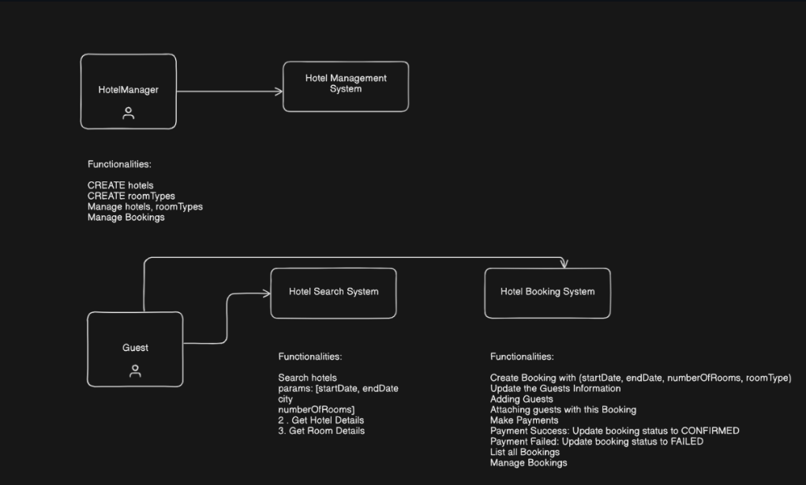
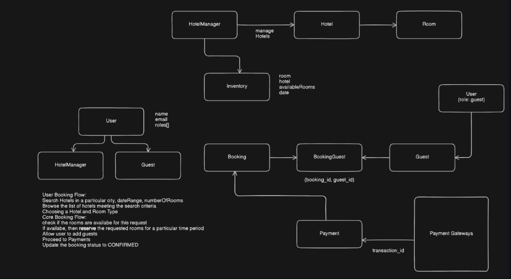
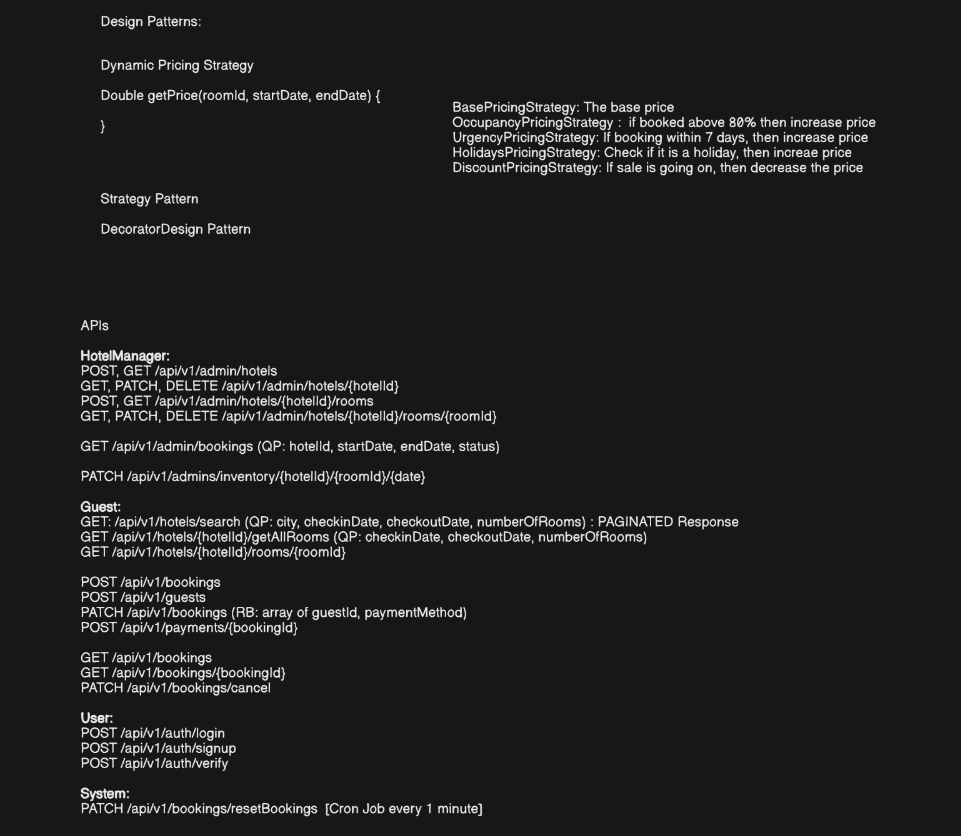
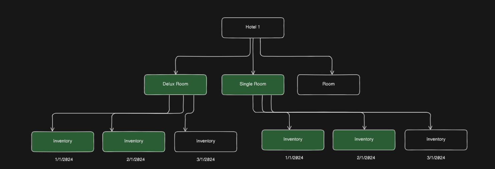
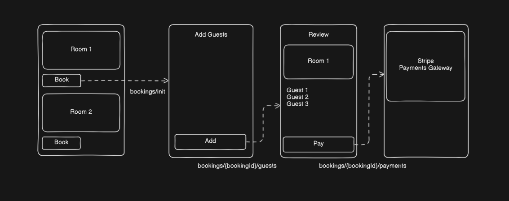
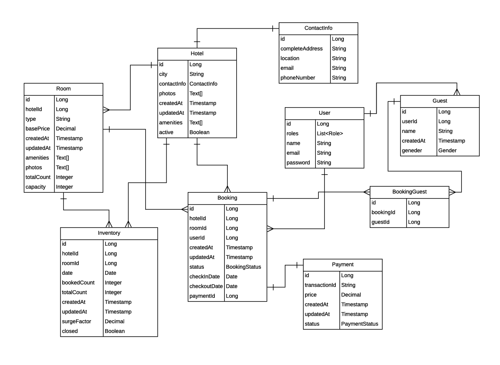

# 🏡 STAYORA 

A production-ready Airbnb-like platform built with **Spring Boot, PostgreSQL, JWT Security, and Stripe Payments**. Designed with scalability, concurrency safety, ACID compliance, and clean architecture in mind.

---

## ✨ Features

* **🔐 Authentication & Security:** JWT-based stateless authentication with role-based access control (USER, GUEST, HOTEL_MANAGER) enforced via Spring Security.
* **🏨 Hotel & Room Management:** Full lifecycle management of hotel and room inventory with dynamic availability and surge pricing.
* **📅 Booking System & Concurrency Safety:** A robust booking flow utilizing **pessimistic locking** paired with `@Transactional` boundaries to ensure absolute atomicity, prevent race conditions, and completely eliminate double-booking vulnerabilities.
* **💳 Stripe Integration:** Secure checkout workflow integrations paired with automated webhook handling to process payment confirmations reliably.
* **⏰ Scheduled Cron Jobs:** Automated cron tasks running every 1 hour to update room prices and apply dynamic surge factors automatically.
* **🛡 ACID Properties:** Structured transactional guarantees maintaining consistency, isolation, and durability across concurrent guest bookings.
* **👨‍💻 SOLID Principles:** A strict adherence to design patterns and clean architecture for maximum maintainability and modular decoupling.
* **📑 API Documentation & Health Checks:** Comprehensive Swagger UI available at `/api/v1/swagger-ui/index.html` alongside Spring Boot Actuator monitoring (`/actuator`).
* **⚡ Scalable Architecture:** Layered design pattern (Controller → Service → Repository) separating logic tiers cleanly.

---

## 📐 System Design & Architecture

STAYORA is architected to handle highly concurrent read/write workflows efficiently while maintaining absolute data integrity. Below are the architectural blueprints detailing how the system is structured.

### 1. 🏢 Functional System Architecture
Defines the functional subsystems isolating the `Hotel Management System` used by managers from the frontend `Hotel Search` and `Hotel Booking` engines accessed by guests.


### 2. 🌐 High-Level Data Flow & System Entities
Maps user categorization rules alongside core business workflows, demonstrating how bookings securely map to specific inventory records and link directly to external payment processors.


### 📊 3. Dynamic Pricing Engine & REST API Endpoints
Highlights the implementation of the **Strategy and Decorator Design Patterns** to calculate room costs dynamically (Base, Occupancy, Urgency, Holiday, and Sale models) along with standard REST paths.


### 📅 4. Hotel Room & Date-Wise Inventory Hierarchy
Details the nested structural breakdown showing how a single Hotel entity splits into specific Room types (e.g., Deluxe vs. Single) and tracks individual inventory blocks grouped strictly by active calendar dates.


### 🔒 5. Booking Initiation & Stripe Checkout Workflow
A step-by-step transactional roadmap detailing user progression from choosing a room layout, appending guest details, verifying order overviews, to finalizing payments securely via Stripe.



### 📊 Database Entity Relationship Diagram (ERD)


### 🔒 Concurrency Safety & Booking Flow
To solve the classic **"Double-Booking"** problem inherent to high-traffic hospitality platforms, the system implements a strict reservation protocol:
* **Pessimistic Locking:** When a guest initiates a checkout session for a specific room and date range, the repository layer applies a pessimistic write lock (`SELECT ... FOR UPDATE`) on the target inventory. Concurrent attempts to read or modify the same inventory block are safely queued.
* **Atomic Operations:** The entire booking sequence—from checking availability, calculating dynamic prices, to reserving the room—is wrapped inside a `@Transactional` block. If the payment gateway crashes or data integrity checks fail, the transaction undergoes an immediate rollback to preserve absolute system consistency.

---

## 🛠️ Tech Stack

| Category | Technology | Purpose / Use Case |
| :--- | :--- | :--- |
| **Language** |  | <kbd><font color="#007396"><b>Core application logic</b></font></kbd> |
| **Framework** |  | <kbd><font color="#6DB33F"><b>REST API development</b></font></kbd> |
| **Security** |  | <kbd><font color="#00c853"><b>JWT authentication & safety</b></font></kbd> |
| **Data Access** |  | <kbd><font color="#33b5e5"><b>Database abstraction layer</b></font></kbd> |
| **Database** |  | <kbd><font color="#4169E1"><b>Relational data storage</b></font></kbd> |
| **ORM** |  | <kbd><font color="#ffbb33"><b>Java-to-SQL object mapping</b></font></kbd> |
| **Payments** |  | <kbd><font color="#aa66cc"><b>Payment processing</b></font></kbd> |
| **API Docs** |  | <kbd><font color="#85EA2D"><b>Interactive API testing</b></font></kbd> |
| **Build Tool** |  | <kbd><font color="#ff4444"><b>Dependency & build management</b></font></kbd> |

### 🧩 Architectural Patterns & Design Choices
* **Strategy & Decorator Patterns:** Utilized to design the modular pricing workflow engine to dynamically manage holiday discounts and surge coefficients.
* **DTO Pattern:** Clean separation of database entities from REST endpoints using distinct mapping classes (`BookingDto`, `HotelInfoDto`).
* **Global Controller Advice:** Centralized response normalization and custom runtime exception mapping (`ResourceNotFoundException`, `UnAuthorisedException`).

---

## 📂 Project Structure

The codebase is structured logically to separate domains, logic layers, and infrastructural components:

```text
com.stayora
├── advice       # Global Response Interceptors & Exception Filters
├── config       # ModelMapper, Stripe, and System configurations
├── controller   # REST Endpoints (Auth, Bookings, Browsing, Inventories, Webhooks)
├── dto          # Data Transfer Objects for decoupled API contracts
├── entity       # Database Entities & Enums (BookingStatus, PaymentStatus, Role)
├── exception    # Domain-specific custom runtime exceptions
├── repository   # Data Access Layer extending Spring Data JPA repositories
├── security     # JWT Filters, Token Providers, and WebSecurityConfig
├── service      # Core Business Logic Layer (Decoupled Interfaces & Implementations)
├── strategy     # Dynamic pricing calculations and surge factor engine
└── utils        # Fetches the current logged-in user from the Security Context Holder
```

## 📦 Getting Started & Installation

### Prerequisites
* **Java Development Kit:** JDK 17 or later
* **Build Tool:** Apache Maven
* **Database:** PostgreSQL instance
* **Payment Processor:** Stripe Developer keys

### Setup Instructions

1. **Clone the repository:**
```bash
git clone [https://github.com/TheProfessorcodes/Stayora.git](https://github.com/TheProfessorcodes/Stayora.git)
cd Stayora
```
2. **Configure Environment Variables:**
   Open `src/main/resources/application.properties` and populate your configurations:
```properties
spring.datasource.url=jdbc:postgresql://localhost:5432/stayora_db
spring.datasource.username=YOUR_POSTGRES_USERNAME
spring.datasource.password=YOUR_POSTGRES_PASSWORD

stripe.api.key=YOUR_STRIPE_SECRET_KEY
stripe.webhook.secret=YOUR_STRIPE_WEBHOOK_SECRET
```
3. **Build the Application:**
   Inside Terminal
   ```mvn clean install```

4. **Run the Server:**
   Inside Terminal
   ```mvn spring-boot:run```


## 🟢 Swagger OpenAPI definition

* **Swagger UI Docs:** [http://localhost:8080/api/v1/swagger-ui/index.html#/](http://localhost:8080/api/v1/swagger-ui/index.html#/)
* **Local Server Root:** [http://localhost:8080](http://localhost:8080)
